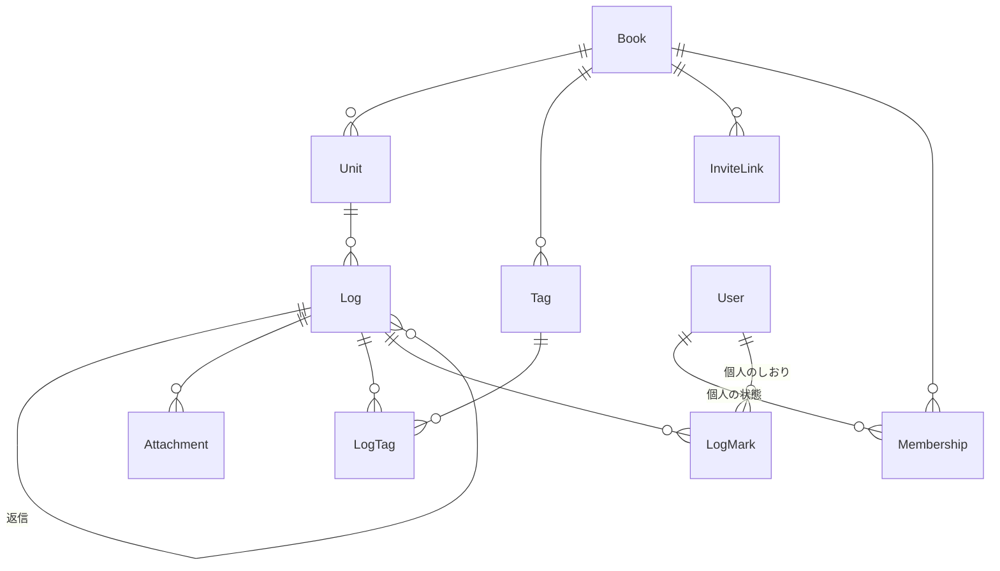

# rinko-app

輪講（ゼミ・研究室の輪講 / reading group）の運営を楽にするアプリ。

**https://rinko-app-silk.vercel.app**

<!-- スクリーンショットはここに置く。撮り方は docs/screenshots.md を参照 -->

研究室の輪講で実際に使いながら作っている個人開発。1人で開発し、
要件定義から設計・実装・運用まで通しでやっている。

- **現状**: 実際の輪講で使える状態。3人での共有を実地で確認済み
- **規模**: 11画面 / テーブル14 / マイグレーション14 / テスト42件
- **中身を見るにはアカウントが要る。** 未ログインでは何も見えない設計のため

読むならこの3つが中身に近い。

| 見たいもの | 行き先 |
|---|---|
| 何をどう決めたか | [docs/requirements.md](docs/requirements.md) |
| 詰まったところと、その原因 | [設計で詰まったところ](#設計で詰まったところ) |
| 判断の記録（見送った案とその理由も） | [CLAUDE.md](CLAUDE.md) |

## 背景・課題

研究室の輪講で、進捗が曖昧になる／全体像が見えない／演習の実施記録が残らない／担当者の予習に見合う進度が出ない、といった課題があった。詳細は [docs/requirements.md](docs/requirements.md) を参照。

## 解決したいこと（MVP）

輪講の進度を一覧でパッと見えるようにし、各回に担当者・目的・記録を残せるようにする。ログにはページ数とハッシュタグを付けて投稿でき、後から検索して該当箇所に戻れる。詳細な機能一覧・データモデルは [docs/requirements.md](docs/requirements.md)、画面構成は [docs/screen-flow.md](docs/screen-flow.md) を参照。

## できること

- **教材と回**: 教材を本棚に並べ、回ごとに担当者・輪講日・学ぶこと・進んだページを持たせる
- **記録**: 回に発言を残す。種別・ページ範囲・ハッシュタグ・画像を付けられ、返信でスレッドになる
- **画像**: 板書やノートの写真を添付できる。アップロード前に縮小するので容量を圧迫しない
- **読み返す**: 投稿順とページ順を切り替えられる。ページが未記入の記録はその場で埋められる
- **探す**: 本文・タイトル・ハッシュタグから検索し、その記録まで飛べる。しおりで印を付けられる
- **共有**: 招待リンクで参加してもらう。書き込める人と見るだけの人を分けられ、リンクは失効できる
- **消す**: 教材と回はゴミ箱を経由して復元できる。記録は確認のうえ完全に消える

**共有されているものの原則**: 追加と編集は参加者全員に同期し、削除だけは作った本人しかできない。
本棚のステータス・並び順・しおりは個人のもので、共有相手には影響しない。

## 技術スタック

| 層           | 選定         | 選んだ理由                                                                                                                      |
| ------------ | ------------ | ------------------------------------------------------------------------------------------------------------------------------- |
| 形態         | Webアプリ    | URLを送るだけで研究室のメンバーに試してもらえる。ネイティブアプリだとTestFlightや各OSごとの配布が必要で、試用のハードルが上がる |
| ビルドツール | Vite         | ログイン必須のツールでありSEOもSSRも不要なため、Next.jsのサーバー側の仕組みが要らない。開発サーバーの起動も速い                 |
| 言語         | TypeScript   | 型があることで実行前に誤りが分かる。フロントとバックエンドで同じ言語を使える                                                    |
| UIライブラリ | React        | 日本語の学習資料が最も多く、詰まったときに解決しやすい                                                                          |
| ルーティング | React Router | Viteと組み合わせる際の標準的な選択                                                                                              |
| スタイリング | プレーンCSS  | ReactとTypeScriptを同時に学ぶ状況のため、独自の記法を増やさず既存のCSSの知識をそのまま使えるものを選んだ。色と幅はCSS変数で1か所にまとめている |
| バックエンド | Supabase     | 認証・共有・ファイル保存が要件そのまま揃い、サーバーのコードをほぼ書かずに複数人での共有を実現できる                            |
| ホスティング | Vercel       | GitHubへのpushで自動デプロイされる                                                                                              |
| テスト       | Vitest       | Viteと同じ設定を共有できる                                                                                                      |

## データモデル



`Book → Unit → Log` が背骨。`Membership` と `LogMark` だけが個人に属する。

**個人の状態と共有の状態を必ず分ける。** これがこのアプリの設計の背骨になっている。

「その人の画面がどう見えるか」に属する情報を `Book` や `Unit` に置くと、
誰か1人の操作が共有相手全員に波及する。本棚のステータス・並び順・削除は
すべて `Membership`（その人と教材の組）側にあり、しおりは `LogMark` という
別のテーブルに分けてある。

たとえば教材のステータスを `Book` に持たせると、**誰かが「学習完了」にした瞬間に
全員の本棚が完了になる。** 途中参加の人も、自分だけ読み返したい人も、個別に
戻せなくなる。この判断は [CLAUDE.md](CLAUDE.md) に経緯ごと残してある。

## 設計で詰まったところ

実際に踏んで直したもの。**どれも1人で試している間は絶対に起きない**、
共有して初めて出る類のものだった。

### 行レベルセキュリティは「見てよいもの」を決めるだけで、「欲しいもの」は決めない

本棚に同じ教材が2つ並んだ。RLSが「参加している教材は見てよい」と許可した結果、
**共有相手の参加情報まで返ってきていた**。RLSは境界を守るだけで、
絞り込みを代わりにやってはくれない。クエリ側で自分の分に絞る条件が別に要る。

同じ形の穴が `shelf_status` の読み書きにもあった。`user_id` の条件を忘れると、
他人のステータスを自分のものとして表示・上書きする。

### 更新ポリシーに `WITH CHECK` を書かないと、`USING` が新しい行の判定に使われる

つまり「自分が触れる範囲どうし」なら、**行の結び付け先を書き換えられる**。
同じ形で3件塞いだ。

- 記録を他の教材の回へ移せた
- 回を自分の教材へ移せた（＝「削除は作成者だけ」を迂回できた）
- 教材の作成者を自分に付け替えられた

新しく更新ポリシーを書くときは必ず疑うこと。

### 「調べてから入れる」は、同時に2回走ると壊れる

招待リンクからの参加がこれで、同じ人が二度開くと重複キーで落ちた。
開発中は React の StrictMode が副作用を2回実行するので**必ず**起きる。

画面側の `cancelled` フラグは結果の扱いを止めるだけで、**送ってしまった問い合わせは
止まらない**。一度の挿入（on conflict）で済ませるのが正解だった。

### データベースは連鎖するが、ストレージは連鎖しない

記録・回・教材を消すとき、画像を先に消す。順番を逆にすると、
参照だけ失ったファイルが残る（実際に2件出した）。

ストレージのポリシーは行ではなく**パス**に対して書くので、
`<book_id>/<log_id>/…` と先頭を教材idにしてある。ここから参加者かどうかを
判定でき、教材を消すときも `<book_id>/` の下をまとめて消せる。

### `insert().select()` は AFTER トリガーより先に評価される

教材を作った直後に作成者を参加者にするトリガーが、`select` に間に合わなかった。
関数（`create_book()`）を経由する形にして解決した。

## セットアップ

```bash
npm install
npm run dev
```

| コマンド         | 内容                             |
| ---------------- | -------------------------------- |
| `npm run dev`    | 開発サーバーを起動する           |
| `npm run build`  | 型チェックと本番用ビルドを行う   |
| `npm run lint`   | コードの誤りを検査する（oxlint） |
| `npm run format` | コードを整形する（Prettier）     |
| `npm test`       | ロジックのテストを走らせる（Vitest） |

### データベース（Supabase）

1. [supabase.com](https://supabase.com) でプロジェクトを作る
2. `cp .env.example .env` して、ダッシュボードの Project Settings > API から URL と anon key を書き写す
3. ローカルのリポジトリをプロジェクトに紐付けてスキーマを適用する

```bash
supabase link --project-ref <プロジェクトのref>
supabase db push
```

スキーマの変更は `supabase/migrations/` にSQLファイルとして残す。
直接ダッシュボードでテーブルをいじると履歴が残らないので行わない。

## ディレクトリ構成

```
src/
  main.tsx          アプリの起点。Reactを画面に描画する
  App.tsx           URLと画面の対応表（ルーティング）
  index.css         全画面に効くスタイル。色と幅はCSS変数で先頭にまとめてある
  auth/             ログイン状態の保持と、未ログインを弾く関門
  components/       複数の画面で使い回す部品
  screens/          画面ごとのコンポーネント（11画面）
  repository/       データの読み書き。画面から直接Supabaseを触らない
  lib/              画面にもデータにも依存しない小さな関数（画像の縮小など）
  dev/              開発時だけ読み込む道具。本番のバンドルには入らない
supabase/migrations/  スキーマの変更履歴（SQL）
docs/               要件定義・画面遷移図・実装計画
```

テストはテスト対象の隣に `*.test.ts` として置いている。対象はロジックだけで、
UIのテストは書かない方針。

## あえて入れていないもの

作れなかったのではなく、要らないと判断したもの。

- **目標ペースと実進捗の差分。** 「遅れています」と言われて嬉しい場面が思い付かなかった。
  輪講は予定通り進まないのが普通で、責める道具になる方が害が大きい
- **本棚の手動並べ替え。** 並べ替えたい場面がまだ来ていない。
  列（`display_order`）だけ先に用意して、UIは作っていない
- **UIのテスト。** テストはロジック（進捗率・スレッドの組み立て・検索・ページ範囲）に
  絞っている。画面の見た目は変わる前提なので、固定すると変更の足かせになる
- **アカウント削除。** 記録を残した人のアカウントは、投稿者名を守る外部キーのため
  消せない。「削除した人の記録は残る」という仕様の帰結で、不具合ではない。
  ただし利用者が自分で消したくなった場合の設計は未検討

## 開発の進め方

- Issueは1機能1つの粒度（半日〜2日で終わる大きさ）
- ブランチ名は `<種類>/<内容>`（`feat/` `fix/` `docs/` `refactor/` `chore/`）
- PR本文に `Closes #N` を書いてIssueと紐付ける
- コード内の識別子は英語、UIの表示は日本語

Issueは縦切り（1つが「画面 → データ取得 → 保存」まで通る単位）で割っている。
土台（環境・DB・認証）だけは縦に切れないので、最初に横切りでまとめて作った。
この考え方と最初の計画は [docs/issues.md](docs/issues.md) に残してある
（**当時の記録であって、現在のIssueとは対応しない**）。

一巡してからは、画面を眺めて探すのをやめて、**実際に使って出た不満だけを
Issueに足す**形に切り替えた。「発言するボタンが記録の数だけ下へ流れる」
「『種別』と言われても何のことか分からない」あたりは、使わなければ出なかった。
