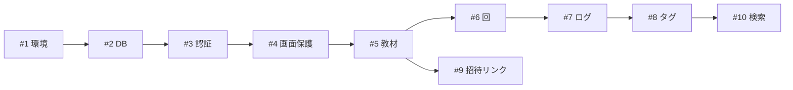

# Issue一覧（実装計画）

[requirements.md](requirements.md) と [screen-flow.md](screen-flow.md) で確定した仕様を、着手できる単位に割ったもの。
GitHub Issueとして登録する前の下書きであり、実際のIssue番号とは対応しない。

## 割り方の方針

**土台だけ横切り、あとは縦切り。**

縦切り（vertical slice）とは、1つのIssueが「画面 → データ取得 → 保存」まで端から端まで通る単位のこと。
判定基準は、**タイトルが「〜できる」の形で書けるか**。

| ✗ 画面ベース | ✓ 縦切り |
|---|---|
| HomeViewを作る | 教材を作成すると本棚に表示される |
| UnitViewを作る | ログを投稿すると一覧の先頭に表示される |

画面ベースで割ると「HomeViewを作る」の中にDBスキーマ・認証・データ取得が隠れてしまい、
着手して初めて依存に気づいて1週間終わらない、という事故が起きる。
縦切りにしておけば**どこで時間切れになっても「動くもの」が残る**。

環境構築・DBスキーマ・認証だけは縦切りにできないので、最初に横切りでまとめて作る。

## 依存関係の骨格

`#5 → #6 → #7 → #8` が背骨。ここが通れば「輪講で記録を残す」が成立する。

---

## M0. 土台（目標: 8/12）

### #1 開発環境をセットアップする
- [ ] Vite + React + TypeScript のプロジェクトが起動する
- [ ] ESLint / Prettier が動く
- [ ] ルーティングが入り、空の画面へ遷移できる

依存: なし

### #2 Supabaseに接続し、DBスキーマを作る
- [ ] [requirements.md](requirements.md) のデータモデル通りにテーブルを作成する（`User` は Supabase Auth の users を利用）
- [ ] Row Level Security を有効にし、参加していない教材のデータが取得できないことを確認する
- [ ] アプリからテーブルの読み書きができる

依存: #1

> データアクセスは1つのディレクトリ（`src/repository/` など）にまとめ、画面から直接Supabaseを呼ばない。
> 後で保存先を変えたくなったときに、画面側を触らずに済む。

### #3 サインアップ・ログイン・ログアウトができる
- [ ] メールとパスワードで新規登録できる
- [ ] 表示名を設定でき、ログの投稿者として表示される
- [ ] ログアウトできる

依存: #2

### #4 未ログインではどの画面も見えない
- [ ] 未ログインでアクセスするとLoginViewにリダイレクトされる
- [ ] ログイン後は元の行き先に戻る

依存: #3

---

## M1. コア（目標: 8/20「輪講で実際に使える」）

このマイルストーンが通れば、実際の輪講で使い始められる。

### #5 教材を作成すると本棚に表示される
- [ ] AddBookViewで書名を入力して作成できる
- [ ] HomeViewに一覧表示される
- [ ] 作成者が自動で `editor` として参加状態になる

依存: #4

### #6 回を作成すると一覧に表示される
- [ ] 教材を開くとSeminarViewに回の一覧が出る
- [ ] タイトル・この回で学ぶこと・担当者・輪講日を入力して作成できる
- [ ] 第N回の番号が自動で採番される
- [ ] 作成後はその回（UnitView）に遷移する

依存: #5

### #7 ログを投稿すると一覧の先頭に表示される
- [ ] 種別・タイトル・本文・ページ数（開始と終了の数値）を入力して投稿できる
- [ ] UnitViewに新しい順で並ぶ
- [ ] ページ数は `p.47-60` の形に整形して表示される

依存: #6

### #8 ログにハッシュタグを付けられる
- [ ] 投稿時にハッシュタグを入力できる
- [ ] ログにタグが表示される
- [ ] 同じ教材内で同名のタグは1つにまとまる

依存: #7

### #9 招待リンクを発行して他の人が参加できる
- [ ] BookSummaryViewから招待リンクを発行できる
- [ ] 受け取った人がAddBookViewの「参加」モードからリンクを入力して参加できる
- [ ] 共有されている教材にはHomeViewで複数人アイコンが出る
- [ ] この時点では参加者は全員 `editor`（権限の分離は #20）

依存: #5

### #10 キーワードとハッシュタグでログを検索できる
- [ ] SearchViewで検索するとヒットしたログが回の順に並ぶ
- [ ] 結果を選ぶと該当のログにジャンプする
- [ ] 頻出ハッシュタグ上位10件がチップで表示され、押すと検索できる
- [ ] 検索対象はログのタイトル・本文・タグ（返信も含む）

依存: #8

---

## M2. 議論を深める（目標: 9/05）

### #11 ハッシュタグのサジェストが出る
- [ ] 入力中に同じ教材内の既存タグが候補として出る
- [ ] 候補を選ぶとそのタグが付く

依存: #8

> これが無いと「正則化」「正則化項」「Regularization」と表記が散らばり検索が機能しなくなる。
> タグを検索の柱に据えた設計なので、優先度は高い。

### #12 ログに返信できてスレッドとして読める
- [ ] ログに返信を投稿できる
- [ ] 返信はスレッド内で古い順に並ぶ（トップレベルは新しい順のまま）

依存: #7

### #13 回のステータスを変更でき、進捗が見える
- [ ] UnitViewでステータス（未着手/進行中/完了）を変更できる
- [ ] 参加者なら誰でも変更できる
- [ ] SeminarViewの各枠にステータスが表示される
- [ ] 完了した回の割合が進捗バーで見える

依存: #6

### #14 教材の概要が見える
- [ ] BookSummaryViewに書名・参加者・次回の担当者と日付・全体の進捗・全体を通しての目標を表示する
- [ ] HomeViewから教材を選ぶとこの画面が開く
- [ ] 「学習を開始する」でSeminarViewへ遷移する

依存: #13

### #15 自分のログを編集・削除できる
- [ ] 自分の投稿のみ編集・削除できる
- [ ] 削除時に確認ダイアログが出る
- [ ] ログを消すとその返信も連鎖して消える

依存: #12

### #16 ロジックにテストを書く
- [ ] 進捗率の計算にテストがある
- [ ] 検索のフィルタ処理にテストがある
- [ ] UIのテストは書かない

依存: #13, #10

---

## M3. 運用に耐える（目標: 9/20）

### #17 教材と回を編集できる
- [ ] BookSummaryViewから書名・表紙画像・目標を編集できる
- [ ] SeminarViewの各枠の編集ボタンから回を編集できる

依存: #14

### #18 教材と回をゴミ箱に入れ、復元・完全削除できる
- [ ] 削除すると確認ダイアログが出てゴミ箱に入る
- [ ] TrashViewから復元できる
- [ ] ゴミ箱から削除すると完全削除される
- [ ] 共有中の教材を削除しても他のメンバーの本棚には残る
- [ ] 参加者が全員完全削除した時点で、教材と配下のデータをデータベースから削除する
- [ ] 削除した人が残したログは残る

依存: #17

### #19 ログにマークを付けて見返せる
- [ ] ログのメニューからマークを付け外しできる
- [ ] マークしたログが見分けられる

依存: #15

### #20 招待リンクに閲覧のみの権限を設定できる
- [ ] リンク発行時に `editor` / `viewer` を選べる
- [ ] `viewer` は閲覧のみで、投稿・編集・削除ができない

依存: #9

### #21 ログにファイルを添付できる
- [ ] PDFや画像を添付して投稿できる
- [ ] ログから開ける

依存: #15

### #22 本棚のステータスを変更してフィルタできる
- [ ] HomeViewは「学習中」の教材のみ表示する
- [ ] 学習予定・学習済みに切り替えて表示できる
- [ ] ステータスを手動で変更できる

依存: #14

### #23 回の一覧をソートできる
- [ ] 日付が新しい順 / 古い順 / 番号順（第1回が上）を切り替えられる
- [ ] 手動のドラッグ並べ替えは行わない（順序は第N回の番号を編集して変える）

依存: #13

### #24 新着があるときに通知して手動更新を促す
- [ ] 画面遷移時にデータを再取得する
- [ ] 他の人の新しい投稿があるときに通知が出る
- [ ] 更新すると最新が表示される

依存: #12

---

## M4. 仕上げ（目標: 9/30）

### #25 本棚を手動で並べ替えられる
依存: #22

### #26 デザインを精査する
- [ ] 色・余白・ボタンの形にルールを決めて全画面に適用する
- [ ] スマホとPCの両方で崩れないことを確認する

### #27 Vercelにデプロイする
- [ ] 本番URLで動作する
- [ ] 未ログインで中身が見えないことを確認する

### #28 友人にユーザーテストしてもらいフィードバックを回収する
依存: #27

### #29 READMEを整備する
- [ ] スクリーンショット、機能一覧、技術選定の理由を書く
- [ ] 技術選定の理由は就活で説明する材料になるので丁寧に書く

---

## 進め方のメモ

- Issueは上から順に着手する。並行して進めない
- 1つのIssueが2日を超えそうなら、その時点で割り直す
- ブランチは `feat/<内容>` を切り、PR本文に `Closes #N` を書く
- M1が終わった時点で一度実際の輪講で使ってみて、そこで出た不満をIssueに足す
