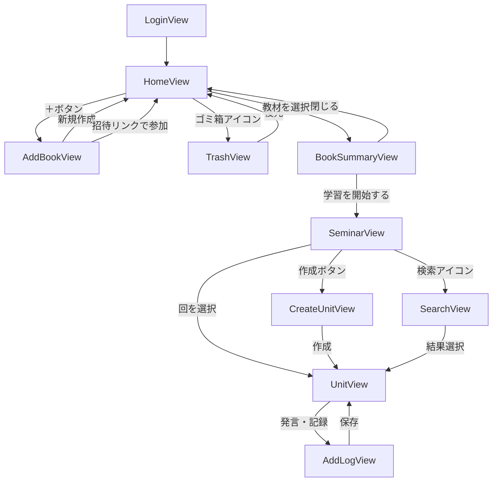

# 画面遷移図 v2

[requirements.md](requirements.md) のMVP機能を、どの画面でどう操作するかに落とし込んだもの。
v1からの変更: StartViewを廃止、アカウント制の導入で LoginView を追加、削除ポリシーの確立で TrashView を追加。

デモ: [prototype/screen-flow-demo.html](prototype/screen-flow-demo.html)
※ v1時点の9画面で作ったもの。ログイン・ゴミ箱・返信などv2の変更は未反映。

## 全体フロー

## 画面一覧

| View | 役割 |
|---|---|
| LoginView | ログイン／アカウント作成。未ログインでは中身が一切見えない |
| HomeView | 学習中の教材を本棚として表示。フィルタで学習予定・学習済みに切り替え。ゴミ箱への入口 |
| AddBookView | 「新規作成」と「招待リンクで参加」の2モード |
| BookSummaryView | 教材の概要。共有リンクの発行、教材の編集・削除もここ |
| SeminarView | 回のリスト。ソート切り替え、検索への入口、回の作成・編集・削除 |
| CreateUnitView | タイトル・この回で学ぶこと・担当者・輪講日を入力して回を作成 |
| UnitView | ログをスレッド表示。投稿・返信・マーク・ステータス変更 |
| AddLogView | 種別・ページ数・本文・ハッシュタグ・添付を入力して投稿 |
| SearchView | 頻出ハッシュタグ上位10件のチップ＋検索バー。結果から該当ログへジャンプ |
| TrashView | 削除した教材・回の復元と完全削除 |

ポップアップにするか画面遷移にするかは実装時に決める。

## 画面ごとの仕様

### LoginView
アカウント方式は本格的なログイン（メール＋パスワード、またはGoogleログイン）。
複数端末から同じアカウントにアクセスする必要があるため、名前だけの軽量な識別では成立しない。

### HomeView
- 表示するのは `shelf_status = reading` の教材のみ
- 学習予定・学習済みはフィルタの切り替えで表示する
- 共有されている教材には複数人アイコンを表示して、ひと目で分かるようにする
- 並び順は手動
- 教材のステータスはここで手動変更する（回の状態からは自動計算しない）

### AddBookView
2つのモードを持つ。
- **新規作成**: 書名と表紙画像を入力する
- **招待リンクで参加**: 受け取ったリンクを入力して参加する

### BookSummaryView
表示する内容: 書名、参加者、次回の担当者と日付、全体の進捗、全体を通しての目標、共有リンク。
教材全体に対する進捗（全12章中5章まで）を見せるのはこの画面の役割とする。
教材名の編集、ステータスの更新、削除もここから行う。

### SeminarView
- 各枠に回のタイトル・担当者・輪講日・ステータスを表示する
- 右上のアイコンからソートを切り替える（日付が新しい順／古い順／番号順）
- 各枠の右上の編集ボタンから、その回の編集・削除を行う
- 「次回はここ」のハイライトは行わない

### CreateUnitView
輪講日は自動で埋めない。行事などで不規則になるため手動で入力する。
担当者の自動ローテーション割り当ては行わない。
作成後は作った回（UnitView）に遷移する。

### UnitView
- トップレベルのログは新しい順、返信はスレッド内で古い順
- ログの右上のメニューからマークを付ける。マークしたログは後から見返しやすくする
- ステータスは参加者なら誰でも変更できる
- 自分の投稿のみ編集・削除できる。ログを消すと、それへの返信も連鎖して消える

### AddLogView
- 種別（なし／予習メモ／疑問／復習）を選ぶ。デフォルトは「なし」で、後から値を追加できる形にする
- ページ数は開始と終了の数値2つを半角で入力し、表示時に `p.47-60` の形に整える
- **ハッシュタグは既存タグをサジェストする。** これがないと表記が揺れて検索が機能しなくなる
- 下書き保存は行わない

### SearchView
- 検索対象はログのタイトル・本文・ハッシュタグ（返信も含む）
- 教材をまたいだ検索、発言者や期間での絞り込みは行わない
- 検索結果は回の順に並べる

### TrashView
削除した教材と回が入る。復元すると元に戻る。
ゴミ箱から削除すると完全削除となり、教材の場合は再参加に招待リンクが必要になる。

## 決定事項とその理由

- **StartViewは廃止した。** Webアプリであればタスクキルの概念がなく、タップを1つ増やすだけになるため。起動時はHomeViewから始まる
- **ハッシュタグ専用View（概念ごとのView）は作らない。** 検索がハッシュタグと本文の両方を横断するため役割が重複する
- **SearchViewには頻出ハッシュタグを上位10件チップ表示する。** ランダム表示だと同じ検索を再現できないため頻度順に固定
- **回の手動ドラッグ並べ替えは行わない。** ソートと手動順序は両立が難しく、ソートをかけると手動の順序が失われる。第N回の番号を正として、順序を変えたいときは番号を編集する
- **教材のステータスと回のステータスは目的が違う。** 前者は本棚の整理用（`shelf_status`）、後者は進捗計算用。名前を分けることで階層の混乱を避ける
- **一括登録は用意しない。** 回は1つずつ作る。まとめて作りたいユーザーは最初に続けて作ればよい

## 実装しながら決めるもの

- **デザインルール。** 色・余白・ボタンの形はある程度作ってから精査する方針
- **理解度の可視化。** まずは返信で質問できる形で運用し、足りなければリアクション機能の追加を判断する

設計上の未決事項は解消済み（[open-questions.md](open-questions.md) 参照）。
