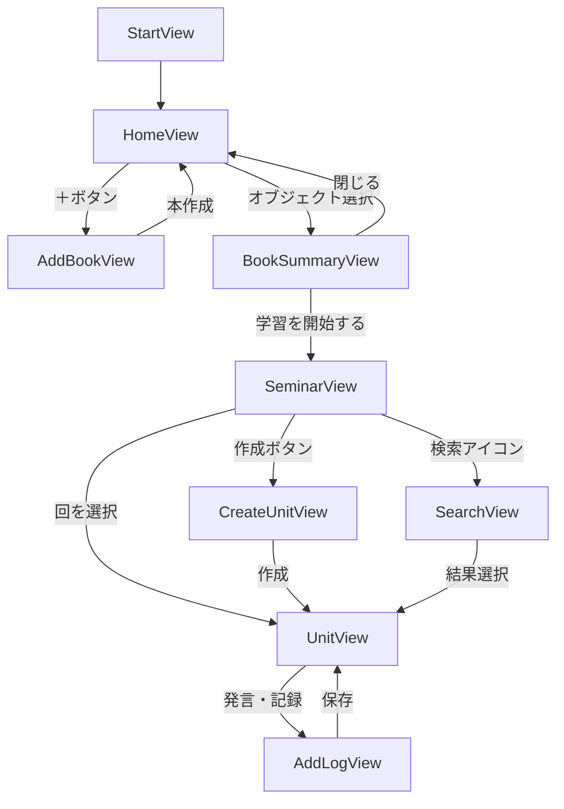

# 画面遷移図 v1

要件定義（[requirements.md](requirements.md)）で定めたMVP機能を、どの画面でどう操作するかに落とし込んだもの。
クリッカブルなデモ: [prototype/screen-flow-demo.html](prototype/screen-flow-demo.html)（ブラウザで直接開ける。データは保存されない見た目確認用）

## 全体フロー

## 画面一覧

| View | 役割 | 対応するデータ |
|---|---|---|
| StartView | 起動時の入口。タスクキル後もここから始まる | ― |
| HomeView | 参加中の輪講（本）をオブジェクトとして一覧表示。＋ボタンで追加 | `Seminar` 一覧 |
| AddBookView | 輪講名・教材名・目標ペース・メンバーを入力して新規作成 | `Seminar` 作成 |
| BookSummaryView | 選んだ本の概要（進捗・ペース・メンバー・共有状態）を表示 | `Seminar` サマリ |
| SeminarView | 回（Unit）を日付順にリスト表示。ステータスと担当者が一覧で見える | `Unit` 一覧 |
| CreateUnitView | タイトル・この回で学ぶこと・担当者・予定日を入力して回を作成 | `Unit` 作成 |
| UnitView | その回に参加者が残したログを時系列で表示。ステータス変更もここ | `Unit` 詳細 + ログ一覧 |
| AddLogView | ページ数・内容・ハッシュタグを入力して発言を記録 | ログ作成 |
| SearchView | 検索バーによるキーワード／ハッシュタグ横断検索。結果から該当ログへジャンプ | ログ全文検索 |

ポップアップにするか画面遷移にするかは実装時に決める（デモではボトムシートとして表現）。

## 決定事項とその理由

- **ハッシュタグ専用View（概念ごとのView）は作らない。** 検索がハッシュタグと本文の両方を横断してヒットさせるため、専用画面を作っても役割が重複する。SearchViewに吸収した。
- **SearchViewには頻出ハッシュタグを上位10件チップ表示する。** ランダム表示も検討したが、同じ検索を再現できず「あのタグをもう一度」が探しにくいため、頻度順に固定。基本の導線はあくまで検索バー。
- **タグを辞書的に一覧するViewはPhase 2以降に保留。** タグ→Unit群の集計ロジックと専用UIが必要でMVPには重い。実際に使ってタグが増えて探しづらくなってから作る。
- **検索の起点はSeminarViewのみ。** 現時点では「今開いている本の中だけ」を検索対象とする。複数の本を横断検索したくなったらHomeView側にも入口が要る。

## 未解決の論点

- **ログ機能とMVP範囲の食い違い。** [requirements.md](requirements.md) は「`Exercise` は独立オブジェクトにせず `Unit.notes` への自由記述に留める」としているが、本画面設計のログ（投稿者・ページ数・ハッシュタグを持つ複数エントリ）は実質的に `Exercise` の再導入に近い。MVPを正式に広げるのか、`Unit.notes` 相当に縮小するのかを決める必要がある。
- **メンバー招待・権限管理の画面が未設計。** 共有ID／共有リンクをどの画面から発行するか、閲覧のみと編集可をどう分けるかが未定。データモデルにも該当項目がない。
- **編集・削除の導線が未設計。** ログの編集／削除、Unitの編集、Seminar自体の編集がどの画面にも配置されていない。
- **PDF等の添付の扱い。** ログにファイルを含めるなら保存先（サーバー保存かリンク参照か）を決める必要があり、技術スタック選定に直結する。
- **レスポンシブ方針。** 主な利用端末（輪講中のPCか、後から見返すスマホか）を決めていない。デモはモバイル前提で作成している。
